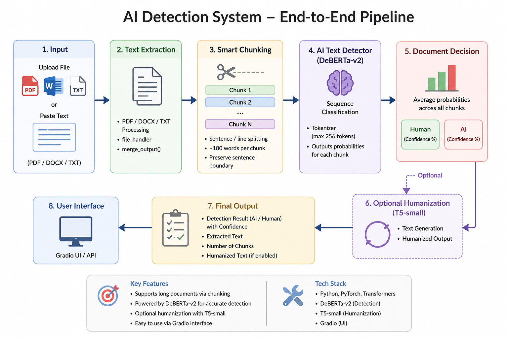

# AI Text Detector & Humanizer

An end-to-end system that detects AI-generated text (DeBERTa-v2) and an experimental humanization model (T5-small) built to test how well that detector holds up against adversarial rewriting.

Built as a graduation project for the **NTI x ITIDA NLP Summer Training Program 2026**.

---

## Project Team 2

- **Mohamed Khaled** — Team Lead..
- Mohamed Azouz
- Khaled Tarek

*(Team member contributions to be detailed further.)*

---

## What this is

Two models, opposite jobs:

1. **AI Text Detector** (DeBERTa-v2-base) — classifies text as human- or AI-written, with document-level aggregation across chunks for long documents.
2. **Humanizer** (T5-small) — an adversarial rewriting model, built specifically to try to get AI-generated text past the detector above.

The result: the humanizer did not succeed. Every rewritten output was still correctly flagged by the detector. That result is reported here as a real finding, not hidden — the project's value is in what it shows about detector robustness, not in producing a working evasion tool.

## Pipeline overview



1. **Input** — PDF, DOCX, TXT, or pasted text
2. **Text extraction** — `file_handler.py` converts all formats into a common text representation
3. **Smart chunking** — text is split into ~180-word chunks (sentence-boundary aware) to fit the detector's 256-token limit
4. **Detection** — DeBERTa-v2 classifies each chunk independently (Human / AI probabilities)
5. **Document-level decision** — chunk probabilities are averaged into one overall result
6. **Optional humanization** — T5-small can rewrite flagged text (experimental, for research purposes — see Results)
7. **Output** — detection result, confidence, extracted text, chunk count, and humanized text if enabled
8. **Interface** — Gradio UI / API

## Results

### Detector performance (Training Unit 1, on HC3 test set)

| Step | Model | Test Accuracy | Test F1 (macro) |
|---|---|---|---|
| 1 | TF-IDF + Logistic Regression (baseline) | 0.9796 | 0.9771 |
| 2 | DistilBERT | 0.9957 | 0.9951 |
| 3 | DeBERTa-v3-base (main model) | 0.9957 | 0.9951 |

Note: DeBERTa did not meaningfully outperform DistilBERT on HC3 despite ~4x longer training time. HC3 alone is a fairly "saturated" dataset — even a simple TF-IDF baseline reached 97.7%, since raw ChatGPT responses in HC3 carry an obvious, easily-detectable stylistic fingerprint.

### The generalization failure (an honest finding)

After training, the detector was manually tested on examples outside HC3's distribution:

- **20 casual human-written sentences:** 20/20 correctly classified as human — but each with exactly 1.000 confidence, indicating overconfidence/miscalibration typical of models trained on narrow datasets like HC3 alone.
- **20 AI-generated sentences written in a deliberately casual, human-like style:** the detector misclassified **18 of 20** as human. A high false-negative rate.

**Root cause:** the detector was trained only on HC3, which contains "raw" ChatGPT responses with obvious formal-register clichés (e.g. "As an AI language model," "In conclusion"). When AI text was disguised in a casual tone, the model fell back on a shallow heuristic — "casual style = human" — because it had never seen casual AI-written examples to learn the real distinguishing signal from.

This is not a bug in the code or training process. It's a real data-scope limitation: HC3 alone isn't sufficient to generalize to adversarially-styled AI text.

### Humanizer result

Built to specifically target and evade the detector above. It failed — every output was still correctly flagged, across multiple prompting strategies and generation attempts.

## Planned improvement: RAID integration

[RAID](https://huggingface.co/datasets/liamdugan/raid) (ACL 2024) is an academic benchmark specifically designed to expose AI-detector weaknesses against adversarial variation — 10M+ texts from 11 generator models, 8-11 domains, 4 decoding strategies, and 11 adversarial attack types (including `paraphrase`, the most relevant one here).

Planned approach:
1. Explore RAID's `attack='paraphrase'` subset via streaming (not a full download — the training file is 11.8GB)
2. Sample a balanced set of paraphrased-AI and matching human text by domain
3. Merge with HC3 (not replace it) into an augmented training set
4. Retrain the detector on the augmented data
5. Evaluate on a held-out set never seen during training (including the 20 casual examples above) to measure real generalization improvement, not just training-set accuracy

**Caveats going in:** the original 20 test examples must never be added to training data (that would be memorization, not generalization), and adding casual AI examples without balancing casual human examples risks flipping the failure mode entirely (the model could learn "casual = AI" instead).

## Models

- 🤗 [AI Text Detector (DeBERTa-v2)](https://huggingface.co/mkhaleddeaf/ai-text-detector)
- 🤗 [Humanizer (T5-small)](https://huggingface.co/mkhaleddeaf/humanizer-t5-small)

## Datasets used

**Detector training:**
- HC3 — human/ChatGPT comparison corpus
- HART
- [RAID](https://huggingface.co/datasets/liamdugan/raid) — planned integration (see above)

**Humanizer training:**
- AI-vs-human dataset
- HIP dataset

## Repository structure

```
notebooks/
├── detector/           training & tuning notebooks
├── humanizer/          humanizer training notebook
└── text_extraction/    PDF/DOCX/image extraction notebook (uses Qwen2-VL-2B-Instruct for image captioning)
src/
└── file_handler.py     text extraction module
docs/
├── test_report.pdf
└── AI_Detection_Project_Team2_Presentation.pptx
assets/
├── pipeline_diagram.png
└── humanizer_model_pipeline.png
pipeline.py              end-to-end pipeline tying detection + humanization together
```

## Tech stack

Python, PyTorch, Hugging Face Transformers, DeBERTa-v2, T5-small, Gradio, PyMuPDF, Qwen2-VL-2B-Instruct

## Intended use

This project is shared for research and educational purposes — to document detector training, an honest evaluation of its generalization limits, and an adversarial robustness test. The humanizer component is not intended, packaged, or recommended for use in evading academic integrity checks, plagiarism detection, or any other real-world detection system.
